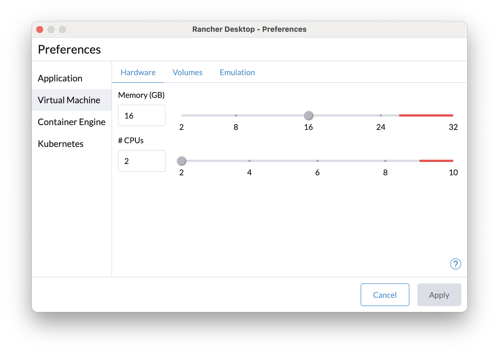
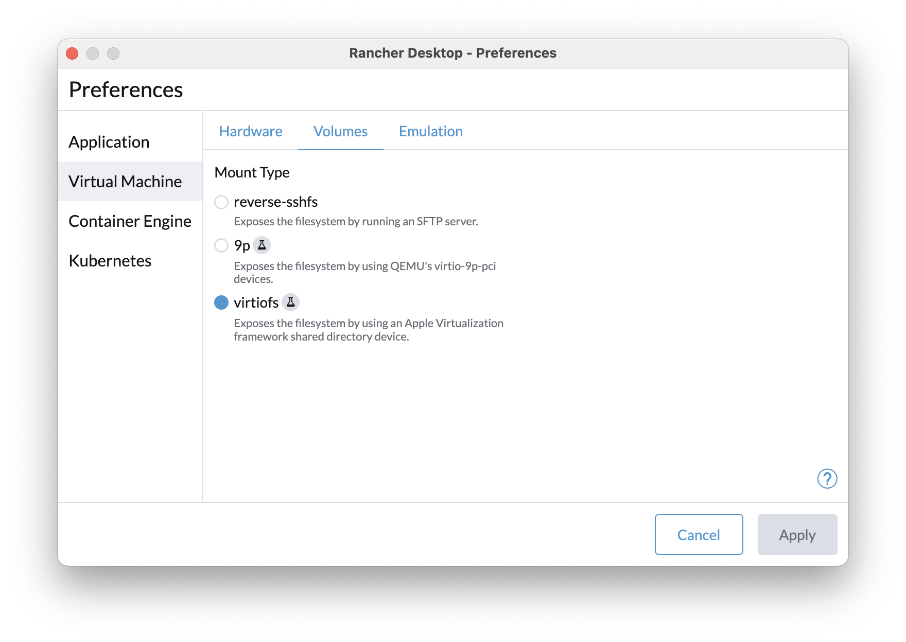
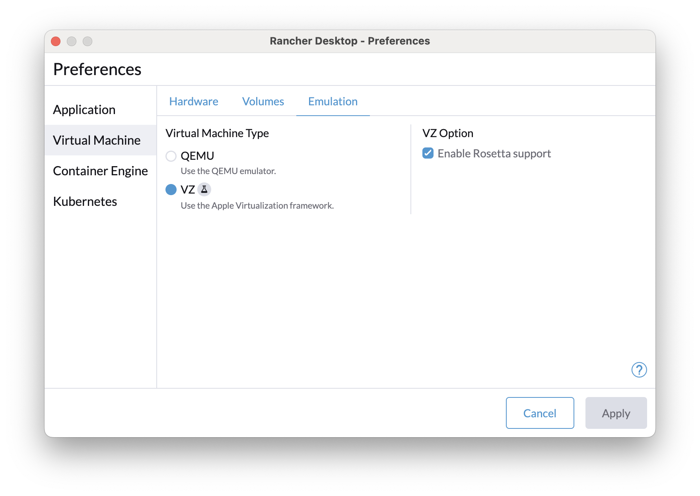
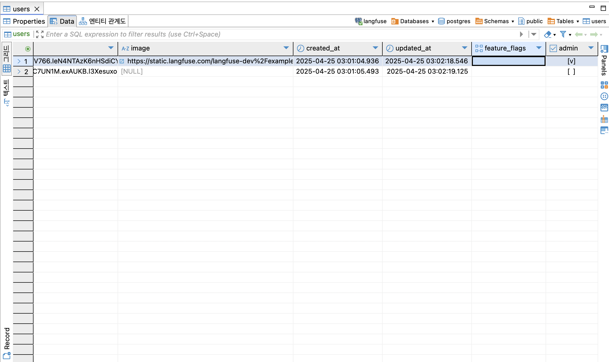

# Guide

- https://github.com/JHSeo-git/langfuse/blob/main/CONTRIBUTING.md#development-setup

## development setup

### 1. pre-requisites

- docker(+ docker compose): [rancher-desktop](https://rancherdesktop.io/)
- node>=20: https://nodejs.org/en/download/package-manager
- pnpm>=9.5: https://pnpm.io/installation
- golang-migrate: https://github.com/golang-migrate/migrate/tree/master/cmd/migrate#migrate-cli

> 여러 docker 컨테이너 실행 등으로 인해 문제를 방지하고자 rancher-desktop 설정에서 메모리 사이즈는 16GB 이상으로 설정합니다.  
>   
>   
> 

### 2. clone

```bash
git clone https://github.com/JHSeo-git/langfuse.git
cd langfuse
```

### 3. env

```bash
cp .env.dev.example .env
```

### 4. dx

> 최초 1번만 실행

```bash
pnpm run dx
```

### 5. run

```bash
pnpm run infra:dev:up
pnpm run dev
```

### 6. open

- Sign up page: http://localhost:3000
- Demo project: http://localhost:3000/project/7a88fb47-b4e2-43b8-a06c-a5ce950dc53a

#### test user

- Username: `demo@langfuse.com`
- Password: `password`

#### admin 권한 획득

`users` 테이블에 admin flag값을 `true`로 변경합니다



### 참고: source to db migrate

```bash
pnpm run db:migrate
```

## monorepo quick start

### 1. run

```bash
pnpm install
pnpm run dev
pnpm --filter=web run dev # execute command only in one package
```

### 2. schema to db migration 반영

```bash
pnpm run db:migrate -- --name <name of the migration>
```

## generate api document with fern

신규 Public API 개발 시 API 문서화를 위해 아래 명령어를 실행합니다.

> fern sdk를 이용합니다.

### 1. fern API Definition 작성

- `fern/apis/server/definition/*.yml` 파일 참고

### 2. fern install global or use npx

```bash
npx fern-api generate --api server
```

```bash
# 또는 global 설치 후 사용
npm install -g fern-api
fern generate --api server
```

### 3. fern generate

**server**

- web/public/generated/api
- web/public/generated/postman
- generated/python

```bash
npx fern-api generate --api server
# or
# fern generate --api server

✔ Directory /Users/jhseo/Workspace/src/github.com/jhseo-git/langfuse/generated/python contains existing files that may be overwritten. Continue? yes
[server]: ✓ All checks passed
[server]: fernapi/fern-openapi Downloaded to /Users/jhseo/Workspace/src/github.com/jhseo-git/langfuse/web/public/generated/api
[server]: fernapi/fern-postman Downloaded to /Users/jhseo/Workspace/src/github.com/jhseo-git/langfuse/web/public/generated/postman
[server]: fernapi/fern-python-sdk Downloaded to /Users/jhseo/Workspace/src/github.com/jhseo-git/langfuse/generated/python
┌─
│ ✓  fernapi/fern-openapi
│ ✓  fernapi/fern-python-sdk
│ ✓  fernapi/fern-postman
└─
```

## 참고

### Langfuse Public API 라이센스 범위

- https://langfuse.com/self-hosting/license-key

| Feature                                                                | Cloud<br/>Free | Cloud<br/>Pro | Cloud<br/>Team | Self-Hosted<br/>OSS | Self-Hosted<br/>Pro | Self-Hosted<br/>Enterprise |
| ---------------------------------------------------------------------- | -------------- | ------------- | -------------- | ------------------- | ------------------- | -------------------------- |
| [Tracing & UI](https://langfuse.com/docs/tracing)                      | ✅             | ✅            | ✅             | ✅                  | ✅                  | ✅                         |
| [Integrations and SDKs](https://langfuse.com/docs/tracing)             | ✅             | ✅            | ✅             | ✅                  | ✅                  | ✅                         |
| [Prompt Management](https://langfuse.com/docs/prompts)                 | ✅             | ✅            | ✅             | ✅                  | ✅                  | ✅                         |
| [Analytics / Dashboards](https://langfuse.com/docs/analytics/overview) | ✅             | ✅            | ✅             | ✅                  | ✅                  | ✅                         |
| [Datasets](https://langfuse.com/docs/datasets/overview)                | ✅             | ✅            | ✅             | ✅                  | ✅                  | ✅                         |
| [Scores](https://langfuse.com/docs/scores/overview)                    | ✅             | ✅            | ✅             | ✅                  | ✅                  | ✅                         |
| [API access](https://langfuse.com/docs/query-traces)                   | ✅             | ✅            | ✅             | ✅                  | ✅                  | ✅                         |

추가로 일부 상업적으로 라이선스 부가 기능:

| Feature                                                                                       | Cloud<br/>Free | Cloud<br/>Pro | Cloud<br/>Team | Self-Hosted<br/>OSS | Self-Hosted<br/>Pro | Self-Hosted<br/>Enterprise |
| --------------------------------------------------------------------------------------------- | -------------- | ------------- | -------------- | ------------------- | ------------------- | -------------------------- |
| [LLM-as-a-Judge evaluations](https://langfuse.com/docs/scores/model-based-evals)              | ✅             | ✅            | ✅             | 🛑                  | ✅                  | ✅                         |
| [Prompt Playground](https://langfuse.com/docs/playground)                                     | ✅             | ✅            | ✅             | 🛑                  | ✅                  | ✅                         |
| [Prompt Experiments](https://langfuse.com/docs/datasets/prompt-experiments)                   | ✅             | ✅            | ✅             | 🛑                  | ✅                  | ✅                         |
| [Annotation Queues](https://langfuse.com/docs/scores/annotation#annotation-queues)            | ✅             | ✅            | ✅             | 🛑                  | ✅                  | ✅                         |
| [PostHog Integration](https://langfuse.com/docs/analytics/posthog)                            | ✅             | ✅            | ✅             | 🛑                  | ✅                  | ✅                         |
| [Data Processing Agreement (DPA)](https://langfuse.com/security)                              | 🛑             | ✅            | ✅             | 🛑                  | 🛑                  | ✅                         |
| [Scheduled Exports to Blob Storage / S3](https://langfuse.com/docs/query-traces#blob-storage) | 🛑             | 🛑            | ✅             | 🛑                  | ✅                  | ✅                         |
| [SOC2 & ISO27001 Reports](https://langfuse.com/security)                                      | 🛑             | 🛑            | ✅             | 🛑                  | 🛑                  | ✅                         |
| [Project-level RBAC roles](https://langfuse.com/docs/rbac)                                    | 🛑             | 🛑            | ✅             | 🛑                  | 🛑                  | ✅                         |
| [Data Retention Policies](https://langfuse.com/docs/data-retention)                           | 🛑             | 🛑            | ✅             | 🛑                  | 🛑                  | ✅                         |
| [Audit Logs](https://langfuse.com/changelog/2025-01-21-audit-logs)                            | 🛑             | 🛑            | ✅             | 🛑                  | 🛑                  | ✅                         |
| [UI Customization](https://langfuse.com/self-hosting/ui-customization)                        | 🛑             | 🛑            | 🛑             | 🛑                  | 🛑                  | ✅                         |
| [Organization Creators](https://langfuse.com/self-hosting/organization-creators)              | 🛑             | 🛑            | 🛑             | 🛑                  | 🛑                  | ✅                         |
| [Organization Management API](https://langfuse.com/self-hosting/organization-management-api)  | 🛑             | 🛑            | 🛑             | 🛑                  | 🛑                  | ✅                         |
